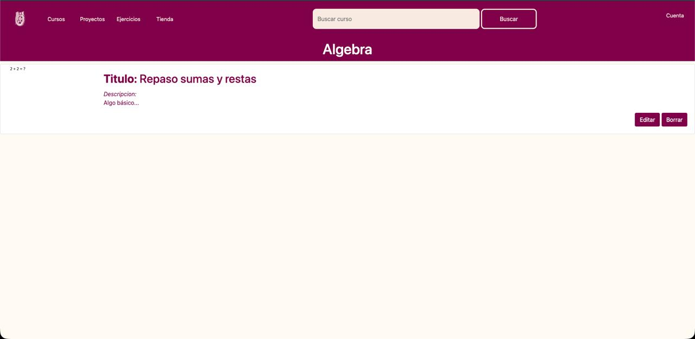
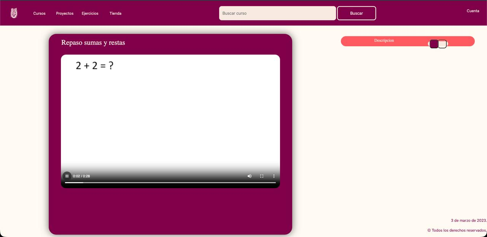
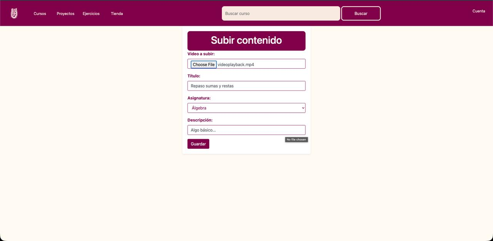

# Welcome to EduStream API 🎓👋

Hello! Welcome to the **EduStream API** repository. 
This project is incredibly special to me because it marks **my very first API**. It is a full-stack web platform built for managing, storing, and streaming educational video content, specifically focused on mathematical and physical sciences (such as Algebra, Calculus, and Discrete Mathematics).

Building this allowed me to understand client-server architecture, relational database integration, and dynamic view rendering.

---

## 📚 About The Project

| Feature                | Details |
| ---------------------- | ------- |
| 🎯 **Purpose**         | A Content Management System (CMS) designed for educators and students to seamlessly upload, categorize, and stream educational videos. |
| ⚙️ **Architecture**     | Built on the Model-View-Controller (MVC) design pattern using Node.js and Express. |
| 💾 **File Management** | Handles physical multimedia (video) uploads and automated deletions directly on the local server. |
| 🔄 **Core Operations** | Upload videos, browse catalogs by subject, stream content, update metadata, and delete records along with their associated local files. |

---

## 🚀 My Tech Stack

### Backend & Server


- **Node.js & Express:** The core of the API. Express allowed me to create clean routes (`/guardar_datos`, `/editar/:id`, etc.) and handle HTTP requests efficiently.
- **Multer:** Middleware used to process `multipart/form-data` and store video files in `public/uploads`.

### Database


- **MySQL:** Stores all metadata (title, subject, description, filename). Integrated with `mysql2` and `express-myconnection`.

### Frontend & Views


- **Handlebars (.hbs):** Template engine for dynamic rendering.
- **Bootstrap 4 & Vanilla JS:** Styling, responsiveness, and UI interactivity.

---

## 🔧 Highlighted Features

| Feature | Description |
|--------|------------|
| **Upload Dashboard** | Upload `.mp4` videos with metadata and categories. |
| **Immersive Video Player** | Dedicated `/visualizar` view with player and side panel. |
| **Smart File Synchronization** | Deletes old files using `fs.unlink` when records are updated or removed. |
| **Dynamic Subject Routing** | Routes like `/:asignaturaSlug` filter content automatically. |

---

## 📸 Project

- 
- 
- 

---

## 🛠️ How to Run Locally

### 1. Clone the repository
```bash
git clone https://github.com/MexboxLuis/EduStreamAPI.git
cd EduStreamAPI
```

### 2. Install dependencies
```bash
npm install
```

### 3. Database Setup

Create a MySQL database named `crud_db` and run:

```sql
CREATE DATABASE crud_db;
USE crud_db;

CREATE TABLE subir (
    id INT AUTO_INCREMENT PRIMARY KEY,
    foto VARCHAR(255) NOT NULL,
    titulo VARCHAR(100) NOT NULL,
    asignatura VARCHAR(100) NOT NULL,
    descripcion TEXT NOT NULL
);
```

> ⚠️ Update your MySQL credentials in `src/app.js` if needed.

### 4. Create uploads folder

```bash
mkdir -p src/public/uploads
```

### 5. Start the server
```bash
node src/app.js
```

### 6. Open in browser
```
http://localhost:3000
```

---

## 💡 Final Notes

This project represents my first step into backend development and API design. 
